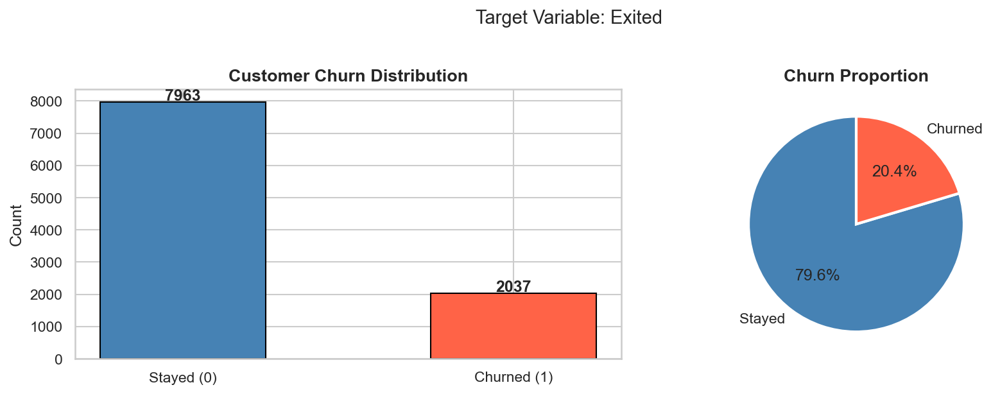
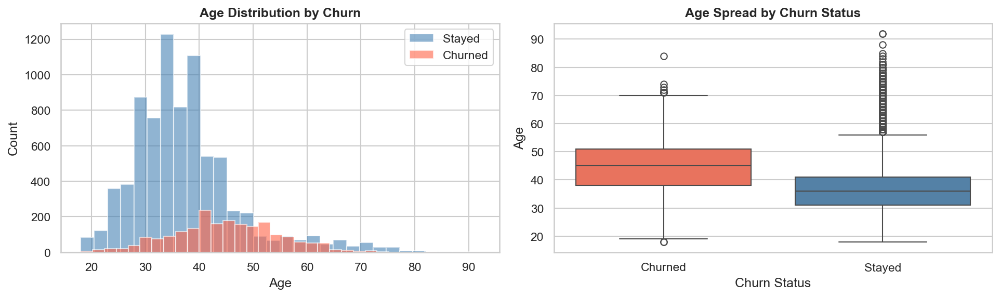
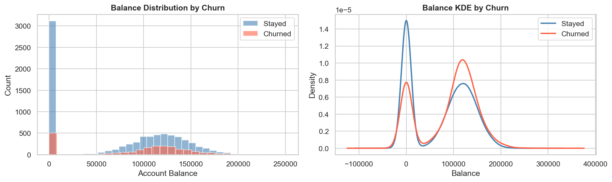
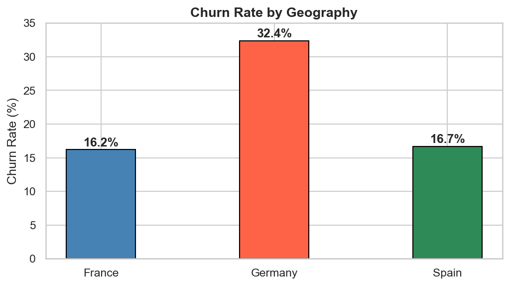
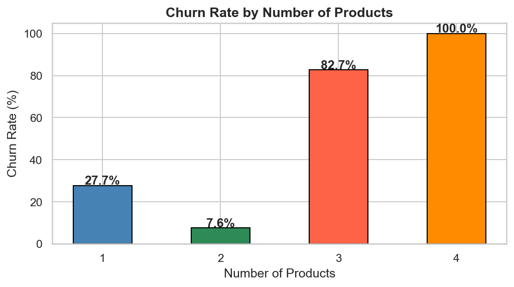
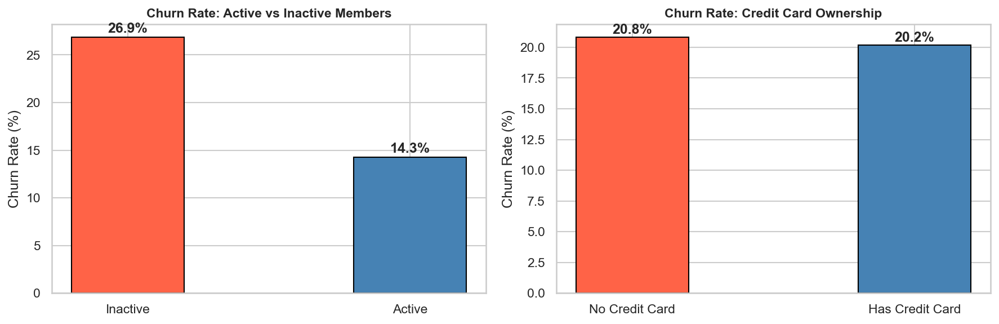
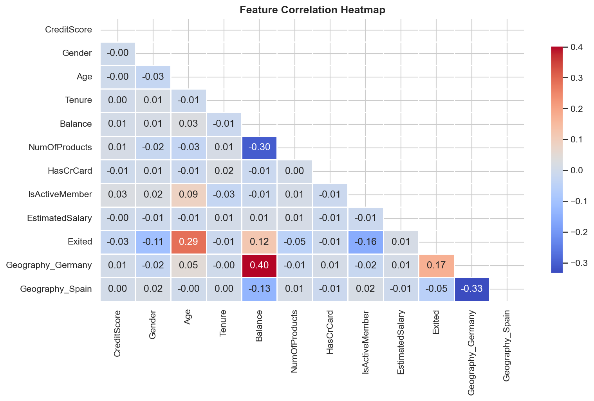
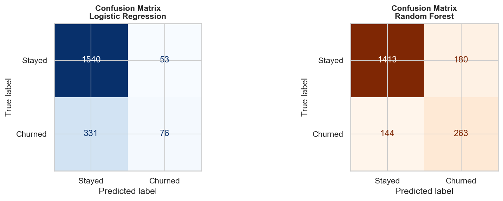
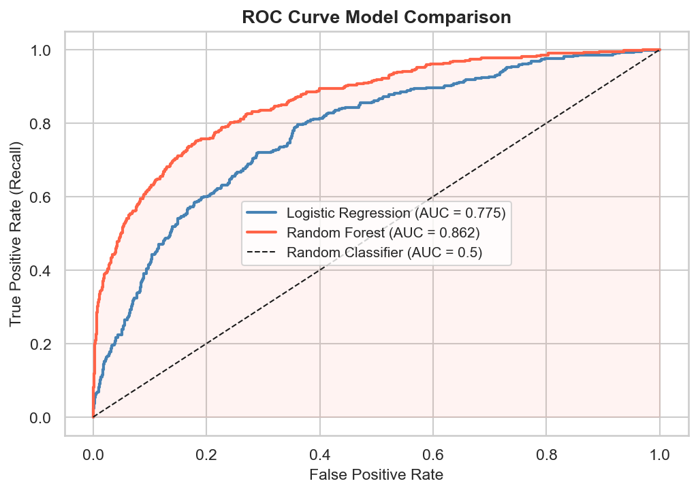
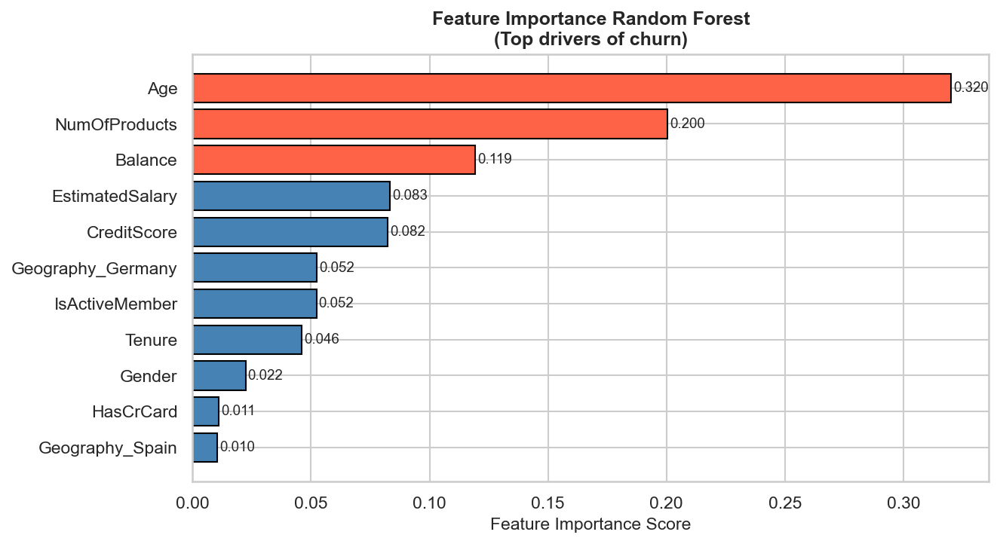

# Customer-Churn-Prediction

> A supervised machine learning project to predict customer churn in a bank using Logistic Regression and Random Forest Classifier.
---

## Task Objective

Customer churn is when a customer stops using a company's services. In banking, retaining existing customers is significantly more cost-effective than acquiring new ones.

**Goal:** Build a binary classification model that predicts whether a bank customer will **churn** (leave) or **stay**, based on their demographic and account information.

| Property | Detail |
|---|---|
| Problem Type | Binary Classification |
| Target Variable | `Exited` 1 = Churned, 0 = Retained |
| Dataset Size | 10,000 customers, 14 features |
| Models Used | Logistic Regression, Random Forest |

---

## Repository Structure

```
Customer-Churn-Prediction/
│
├── Task3_CustomerChurnPrediction.ipynb   # Main notebook full ML pipeline
├── ChurnModelling.csv                       # Raw dataset
├── README.md                                # Project documentation (this file)
└── Images/
           ├── 01_target_distribution.png
           ├── 02_age_distribution.png
           ├── 03_balance_distribution.png
           ├── 04_churn_by_geography.png
           ├── 05_churn_by_products.png
           ├── 06_active_member_creditcard.png
           ├── 07_correlation_heatmap.png
           ├── 08_confusion_matrices.png
           ├── images/09_roc_curve.png
           ├── 10_feature_importance.png
```

---

## Dataset

**Source:** Churn Modelling Dataset  
**File:** `ChurnModelling.csv`  
**Size:** 10,000 rows × 14 columns  
**Missing Values:** None  
**Class Distribution:** ~80% Retained, ~20% Churned (imbalanced)

| Feature | Type | Description |
|---|---|---|
| RowNumber | Integer | Row index removed (not useful) |
| CustomerId | Integer | Unique ID removed (not useful) |
| Surname | String | Customer surname removed (not useful) |
| CreditScore | Integer | Customer credit score |
| Geography | Categorical | Country: France / Spain / Germany |
| Gender | Categorical | Male or Female |
| Age | Integer | Customer age |
| Tenure | Integer | Years as a bank customer |
| Balance | Float | Account balance |
| NumOfProducts | Integer | Number of bank products used (1–4) |
| HasCrCard | Binary | Has credit card 1 = Yes, 0 = No |
| IsActiveMember | Binary | Active member 1 = Yes, 0 = No |
| EstimatedSalary | Float | Estimated annual salary |
| **Exited** | **Binary** | **TARGET Churned: 1, Retained: 0** |

---

## Approach

### Step 1: Data Cleaning & Preparation
- Dropped irrelevant columns: `RowNumber`, `CustomerId`, `Surname`
- Verified zero missing values and no duplicate rows
- Applied **Label Encoding** to `Gender` → Female = 0, Male = 1
- Applied **One-Hot Encoding** to `Geography` → 2 dummy columns created (`Geography_Germany`, `Geography_Spain`), `drop_first=True` to avoid multicollinearity
- Applied **StandardScaler** to normalise all features before model training

### Step 2: Train-Test Split
- 80% training / 20% testing
- **Stratified split** used to preserve the 80/20 class ratio in both sets

### Step 3: Model Training
- Trained **Logistic Regression** as a linear baseline
- Trained **Random Forest Classifier** as the main ensemble model with `class_weight='balanced'` to handle class imbalance

---

## Exploratory Data Analysis

Seven visualisations were produced to understand the data before modelling:

| # | Visualisation | Key Finding |
|---|---|---|
| 1 | Target Distribution (bar + pie) | Dataset is imbalanced 79.6% stayed, 20.4% churned |
| 2 | Age Distribution by Churn (histogram + boxplot) | Customers aged 40–60 churn the most |
| 3 | Balance Distribution by Churn (histogram + KDE) | Churned customers are not just zero-balance holders |
| 4 | Churn Rate by Geography | Germany: ~32% churn vs France: ~16% and Spain: ~17% |
| 5 | Churn Rate by Number of Products | Customers with 3–4 products churn at over 80% |
| 6 | Active Member vs Credit Card | Inactive members churn at ~27% vs ~14% for active members |
| 7 | Correlation Heatmap | Age and NumOfProducts show the strongest correlation with Exited |

### Target Variable Distribution


### Age Distribution by Churn


### Balance Distribution by Churn


### Churn Rate by Geography


### Churn Rate by Number of Products


### Active Member vs Credit Card


### Correlation Heatmap


---

## Model Training

| Setting | Value |
|---|---|
| Train / Test Split | 80% / 20% |
| Split Strategy | Stratified (preserves class ratio) |
| Feature Scaling | StandardScaler (mean = 0, std = 1) |
| Random State | 42 |

### Logistic Regression (Baseline)
- `max_iter = 1000`
- Scaled features used
- Linear decision boundary

### Random Forest Classifier (Main Model)
- `n_estimators = 100` (100 decision trees)
- `max_depth = 10` (prevents overfitting)
- `class_weight = 'balanced'` (handles imbalance)
- Provides feature importance scores

---

## Evaluation Results

### Model Comparison

| Metric | Logistic Regression | Random Forest |
|---|---|---|
| Accuracy | ~81% | ~86% |
| Precision (Churn) | ~57% | ~75% |
| Recall (Churn) | ~20% | ~51% |
| F1 Score (Churn) | ~29% | ~61% |
| ROC-AUC | ~77% | ~86% |

### Confusion Matrices


### ROC Curve Comparison


### Feature Importance


> **Best Model: Random Forest:** outperforms Logistic Regression on all metrics, especially ROC-AUC and F1 Score for the churn class.

### Feature Importance (Random Forest Top 5)

| Rank | Feature | Importance |
|---|---|---|
| 1 | Age | Highest |
| 2 | NumOfProducts | High |
| 3 | IsActiveMember | High |
| 4 | Balance | Medium |
| 5 | Geography_Germany | Medium |

---

## Key Insights

- **Germany** has the highest churn rate (~32%) region-specific issues may exist
- **Age** is the strongest churn predictor; customers aged 40–60 are most at risk
- Customers with **3 or 4 products** churn at over 80% product overload drives dissatisfaction
- **Inactive members** are nearly twice as likely to churn as active members
- Customers with **non-zero balances** also churn, suggesting financial dissatisfaction rather than simple account closure

---

## Technologies Used

| Technology | Version | Purpose |
|---|---|---|
| Python | 3.x | Core programming language |
| Jupyter Notebook | — | Interactive development environment |
| pandas | Latest | Data loading, cleaning, manipulation |
| NumPy | Latest | Numerical computations |
| matplotlib | Latest | Base visualisation library |
| seaborn | Latest | Statistical visualisations and heatmaps |
| scikit-learn | Latest | Encoding, scaling, model training, evaluation |

---

## How to Run

### 1. Clone the Repository
```bash
git clone https://github.com/your-username/Data-Science-Internship-Task3-ChurnPrediction.git
cd Customer-Churn-Prediction
```

### 2. Install Dependencies
```bash
pip install pandas numpy matplotlib seaborn scikit-learn jupyter
```

### 3. Launch the Notebook
```bash
jupyter notebook Task3_CustomerChurnPrediction.ipynb
```

### 4. Run All Cells
In Jupyter: **Kernel → Restart & Run All**

> Make sure `ChurnModelling.csv` is in the same folder as the notebook before running.

---

## Skills Demonstrated

- Categorical Data Encoding: Label Encoding and One-Hot Encoding
- Supervised Classification Modelling
- Understanding and Interpreting Feature Importance
- Model Evaluation with multiple metrics (Accuracy, Precision, Recall, F1, AUC)
